# SACA — Code Flow & File Map

End-to-end flow from **dataset / training** → **NLP** → **ML (TFLite)** → **Desktop & Mobile apps**.

```mermaid
flowchart TB
    subgraph ML["saca-machine-learning-app/ (ML)"]
        CSV["disease_dataset.csv"]
        NB["ML_Disease_Classifier.ipynb"]
        TFL["model.tflite"]
        META["model_meta.json"]
        VOC["symptom_vocab.json"]
        TEST["test.py"]
        CSV --> NB
        NB --> TFL
        NB --> META
        NB --> VOC
        TFL --> TEST
        META --> TEST
        VOC --> TEST
    end

    subgraph NLP["saca-windows-app-v3/nlp/ + services (NLP)"]
        PRE["preprocess.py"]
        LANG["language_detector.py"]
        KRI["kriol_translator.py"]
        EXT["symptom_extractor.py"]
        MAP["symptom_mapper.py"]
        NEG["negation_detector.py"]
        NSVC["nlp_service.py"]
        PRE --> NSVC
        LANG --> NSVC
        KRI --> NSVC
        EXT --> NSVC
        MAP --> NSVC
        NEG --> NSVC
    end

    subgraph DESKTOP["saca-windows-app-v3/ (Desktop)"]
        MAIN["main.py"]
        MW["main_window.py"]
        TRI["triage_orchestrator.py"]
        MLW["ml_tflite_service.py"]
        PAGES["UI pages"]
        MAIN --> MW
        MW --> TRI
        TRI --> NSVC
        TRI --> MLW
        MLW --> TFL
        MW --> PAGES
    end

    subgraph MOBILE["saca-android-app/ (Mobile)"]
        MA["MainActivity.kt"]
        VM["TriageViewModel.kt"]
        ENG["TFLiteInferenceEngine.kt"]
        UI["Screens"]
        MA --> VM
        VM --> ENG
        ENG --> TFL
        MA --> UI
    end

    TFL --> MLW
    VOC --> MLW
    META --> MLW
    TFL --> ENG
    VOC --> ENG
```



---

## 1) Machine Learning (`saca-machine-learning-app/`)

| File | Role |
|------|------|
| `disease_dataset.csv` | Training data: `disease`, `ats_level`, symptom columns (0/1) |
| `ML_Disease_Classifier (1).ipynb` | Main pipeline: load → preprocess → ATS labels → sklearn models → ensemble → export TFLite → Colab tests |
| `Symptom_Severness_classification.ipynb` | Earlier / alternate notebook (disease classifier + demos) |
| `model.tflite` | **Deployed model** used by Android & Windows (on-device inference) |
| `model_meta.json` | Output order, severity labels, input shape `[1, 234]` |
| `symptom_vocab.json` | Symptom tokens for multi-hot input (index 0 = `None`) |
| `test.py` | Local CLI to run preset scenarios against `model.tflite` |

**ML outputs (what apps consume):**

| Output | Meaning |
|--------|---------|
| `confidence` | Model certainty (High / Medium / Low in UI) |
| `needs_follow_up` | Score ≥ 0.5 → ask more yes/no questions |
| `severity` | `MILD`, `MODERATE`, `NEEDS_REST` |
| `suggested_symptoms` | Extra symptoms to check (if follow-up needed) |

**Copy after export:**

- Desktop: `saca-windows-app-v3/models/ml/`
- Android: `saca-android-app/app/src/main/assets/` (`model.tflite`, `model_meta.json`, `symptom_vocab.json`)

---

## 2) NLP — Natural Language Processing (Windows)

NLP turns **typed / spoken / Kriol text** into **canonical symptom tokens** before ML runs.

### Core NLP module (`saca-windows-app-v3/nlp/`)

| File | Role |
|------|------|
| `preprocess.py` | Clean text, normalise spelling |
| `language_detector.py` | Detect English / Kriol / mixed |
| `kriol_translator.py` | Kriol → English (dictionary-based) |
| `neural_translator.py` | Optional neural translation (if deps installed) |
| `symptom_extractor.py` | Pull symptom phrases from text |
| `symptom_mapper.py` | Map phrases → standard symptom names |
| `negation_detector.py` | Handle “no fever”, “not coughing”, etc. |
| `bilstm_negation.py` | Optional Bi-LSTM negation (advanced) |
| `bert_extractor.py` | Optional BERT extraction (advanced) |
| `feature_engineer.py` | Feature helpers for NLP pipeline |
| `voice_processor.py` | Voice / audio preprocessing hooks |

### NLP integration & data (`saca-windows-app-v3/`)

| File | Role |
|------|------|
| `src/services/nlp_service.py` | **Main NLP API** — `process_user_input(text)` → symptoms + follow-up question hints |
| `src/utils/question_tree.py` | Rule-based follow-up / red-flag questions |
| `data/kriol_dictionary.json` | Kriol ↔ English dictionary |
| `data/dictionaries/kriol_to_english.json` | Translation pairs |
| `data/symptoms.json` | Symptom lists for matching |
| `data/synonyms.json` | Synonym → canonical symptom |
| `src/data/synonyms.json` | App copy of synonyms |
| `demo_nlp_translation.py` | Standalone NLP demo script |

**Note:** Android does **not** use the full Python NLP stack; it matches symptoms from **typed text / speech transcript / pictogram labels** against `symptom_vocab.json` inside `TFLiteInferenceEngine.kt`.

---

## 3) Desktop app (`saca-windows-app-v3/`)

| File | Role |
|------|------|
| `main.py` | App entry — launches PySide6 UI |
| `src/ui/main_window.py` | Navigation between pages, wires NLP + triage |
| `src/services/triage_orchestrator.py` | **Orchestrator** — NLP → initial ML → follow-up Qs → final ML → result |
| `src/services/ml_tflite_service.py` | Loads `models/ml/model.tflite`, builds vector, runs inference |
| `src/services/ml_service.py` | Legacy / alternate ML helper |
| `src/services/voice_service.py` | Speech input (Whisper, etc.) |

### UI pages (`src/ui/pages/`)

| File | Role |
|------|------|
| `home_page.py` | Home / language |
| `input_page.py` | Type symptoms |
| `symptom_selection_page.py` | Picture / symptom picker |
| `questions_page.py` | Follow-up yes/no (+ pain scale display) |
| `results_page.py` | Final triage result |
| `emergency_page.py` | Emergency flow |

### Desktop ML assets (`models/ml/`)

| File | Role |
|------|------|
| `model.tflite` | Copy from `saca-machine-learning-app/` |
| `model_meta.json` | Model contract |
| `symptom_vocab.json` | Vocabulary |

### Desktop flow (runtime)

```
User text/voice/pictures
    → nlp_service.process_user_input()
    → triage_orchestrator.run_initial_assessment()
        → ml_tflite_service.assess_symptoms()  [Round 1]
        → follow-up questions (rules + suggested_symptoms)
    → User answers Yes/No
    → triage_orchestrator.run_final_assessment()
        → ml_tflite_service.assess_symptoms()  [Round 2]
    → results_page (mild / moderate / critical + advice)
```

---

## 4) Mobile app (`saca-android-app/`)

| File | Role |
|------|------|
| `app/src/main/java/com/example/saca/MainActivity.kt` | App entry, Compose host |
| `app/src/main/java/com/example/saca/viewmodel/TriageViewModel.kt` | State + calls inference on “Next” |
| `app/src/main/java/com/example/saca/ml/TFLiteInferenceEngine.kt` | Loads TFLite + vocab from **assets**, runs model |
| `app/src/main/java/com/example/saca/model/ModelInferenceResult.kt` | `confidence`, `needsFollowUp`, `severity`, `suggestedSymptoms` |
| `app/src/main/java/com/example/saca/model/Severity.kt` | Maps model severity → UI levels |
| `app/src/main/java/com/example/saca/navigation/AppNavGraph.kt` | Screen navigation |
| `app/src/main/java/com/example/saca/navigation/Screen.kt` | Route definitions |

### UI screens (`ui/screens/`)

| File | Role |
|------|------|
| `LanguageSelectScreen.kt` | English / Kriol |
| `InputModeSelectScreen.kt` | Type / Speak / Pictures |
| `TextInputScreen.kt` | Typed symptoms |
| `SpeechInputScreen.kt` | Voice input |
| `PictogramInputScreen.kt` | Tap symptom icons |
| `SymptomInputScreen.kt` | Symptom entry helper |
| `ResultScreen.kt` | Shows severity, confidence, follow-up hint |

### Android assets (`app/src/main/assets/`)

| File | Role |
|------|------|
| `model.tflite` | On-device model (**copy from ML folder**) |
| `symptom_vocab.json` | Vocabulary (in repo) |
| `model_meta.json` | Add if you use metadata in engine |

### Mobile flow (runtime)

```
Language → Input mode → Type / Speak / Pictures
    → TriageViewModel.runInference()
    → TFLiteInferenceEngine.runInference(text)
        → tokenise / substring match → multi-hot [1, 234]
        → model.tflite
    → ResultScreen (severity, confidence, follow-up)
```

---

## 5) Two ML systems (don’t mix them in demos)

| System | Where | Predicts |
|--------|--------|----------|
| **Sklearn ensemble** (RF, DT, NB, ET) | `ML_Disease_Classifier.ipynb` | **Disease name** (e.g. common cold, cardiac arrest) |
| **TFLite neural model** | `model.tflite` in apps | **Severity + follow-up** (not disease name) |

**Apps use only `model.tflite`.** The sklearn path is for research / Colab disease classification.

---

## 6) Quick file checklist for presentations

| Layer | Must-show files |
|-------|------------------|
| ML | `disease_dataset.csv`, `ML_Disease_Classifier (1).ipynb`, `model.tflite`, `symptom_vocab.json`, `test.py` |
| NLP | `nlp_service.py`, `symptom_extractor.py`, `kriol_translator.py`, `question_tree.py` |
| Desktop | `main.py`, `triage_orchestrator.py`, `ml_tflite_service.py`, `questions_page.py`, `results_page.py` |
| Mobile | `TriageViewModel.kt`, `TFLiteInferenceEngine.kt`, `ResultScreen.kt`, assets |
